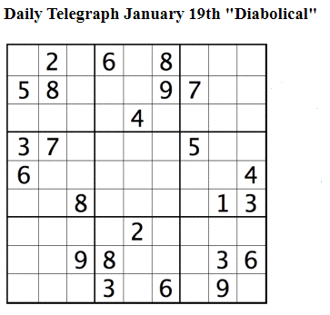
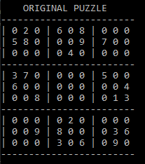
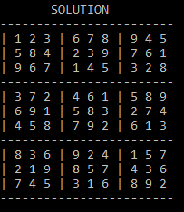
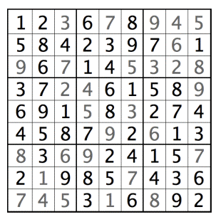

# Sudoku-Solver
Sudoku Solver algorithm written in Python. 

The following is one sudoku puzzle (Hard Difficulty) from the Daily Telegraph:  

The original puzzle regenerated using Python:  

The solution generated from the sudoku solver algorithm:  

Comparing the solution with the one provided by the creator of the puzzle:  

